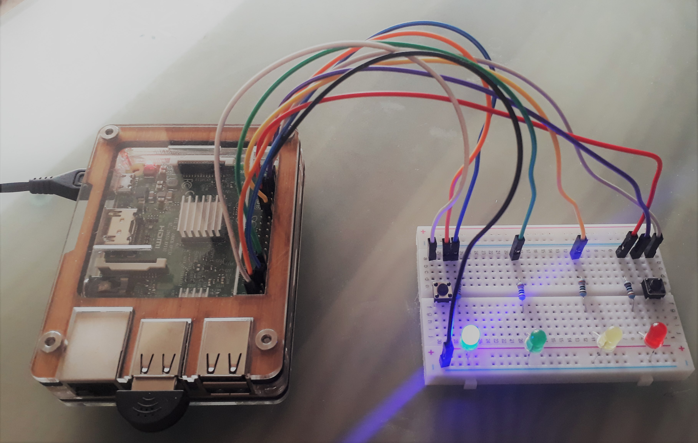

```{r setup, include=FALSE}
knitr::opts_chunk$set(echo = TRUE)
```



## Introduction

The **Check Your Tone** project is an attempt to create a near real-time speech-to-text sentinment analyzer. A mix of technologies underlie the project including (1) the Amazon Transcribe web service for automatic speech recognition, (2) Keras/TensorFlow for training a neural net text sentiment classifier, and (3) Raspberry Pi for audio data collection and software management.

Users will use the push button to initiate a short audio recording from, for example, a practice presentation or writing project. The recording will then be converted to text and subsequently analyzed to determine if the *tone* of the message skews negative, positive, or is neutral. Information about the analyzed recording will be presented to the user via the terminal and using indicator LEDs controlled by the Rasberry Pi.

All code for this project is written for Python 3.6+.

## Installation (Raspberry Pi OS)

### Raspberry Pi Setup

Once the Raspberry Pi OS has been installed, download the file `setup_pi.sh` and run from a terminal window. This project is tested on a Raspberry Pi 3 Model B v1.2 (more detailed information can be found in `system.txt`).

```
bash config/setup_pi.sh
```
* Installs `shutdown_button.py` script, which assumes a shutdown button is connected to pin 22 (BCM)

## Features

### Text Analysis from CLI

Analyze the sentiment from text only using the command line interface and the `cyt.py` script:

```
python cyt.py

> Enter some text: This text sentiment analyzer will be useful when practicing for a presentation or drafting a writing project. It estimates the sentinment of example text using deep learning models that were trained on the IMDB movie reviews data set. See below for more information about how the models were created! I hope you enjoy using this project.

> Predicted sentiment score is [0.44]: NEUTRAL
```

### Speech-to-Text Sentiment Analysis

Once an audio recording has been transcribed to text, using AWS Transcribe, the sentiment of the resulting transcript is estimated by two neural network models, which were each trained on the [IMDB Movie Reviews Data Set](https://ai.stanford.edu/~amaas/data/sentiment/) of over 50,000 user reviews. Training on this binary classification data set allows the neural network models to distinguish between "positive" and "negative" tone, and ultimately gives each new text sample a score between 0 (negative) and 1 (positive) indicating the overall sentiment. This task is also made possible thanks to the pre-trained word embeddings provided by the [GloVe project](https://nlp.stanford.edu/projects/glove/), which is based on a corpus of text scraped from sites across the web. The neural network models I used here are two architectures that are each well-suited and widely used for time-series data and text classification: a recurrent neural network (RNN) and one-dimensional convolutional neural network (CNN). The output scores of each model are averaged together in order to make an *ensemble prediction* about the sentiment of a text sample. 

To prepare training/validation data sets, create word embeddings, and train the models, I opted to use a Google Colaboratory hosted runtime, primarily for access to high-end GPUs, which greatly improve the speed of training the models, and for easy integration of cloud file storage. I have included in this repository a copy of my Colab notebook (`py/sentiment_classifier_training.ipynb`), which should make it easy to reproduce my results or modify them for other purposes. The Colab notebook can also be accessed from your browser [here](https://colab.research.google.com/drive/1YzP5I5b3PTRIVaXC0HPBxC_oWMpByZdo?usp=sharing).

**An overview of the neural network architectures used for this project, RNN (left) and CNN (right):**

<p float="left">
  
   
</p>
